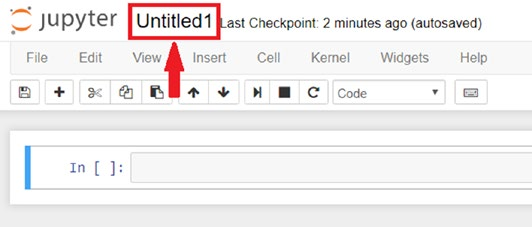

## 周四：使用Jupyter Notebook

在本书的课程中，我们将在Jupyter Notebook里度过大部分时光。Jupyter Notebook是数据科学社区使用的强大工具，它使我们能更容易地学习Python。因为通过Jupyter Notebook，我们可以专注于编写代码。今天的课程中，我们将学习如何打开并且使用Jupyter Notebook的工具、单元格。

---

**注意**: 本书的每一节课，你都会打开Jupyter Notebook，所以请把这一页放在手边，便于你需要再次查询。

---

### 打开Jupyter Notebook

Jupyter Notebook可以通过Anaconda程序打开；但是，我希望你开始习惯终端，并且熟练掌握如何操作终端。所以我们不打算通过Anaconda打开Jupyter Notebook，而通过终端来做。这样做有两个好处如下：

- Jupyter Notebook将在终端所在同一目录下被打开

- 学会使用终端将有助于你成为一名专业的开发人员

如果您没有关闭昨天打开的终端会话，请跳过以下的第一步。
#### 第一步 打开终端
我们需要打开终端和“cd”到我们的“python_bootcamp”目录:

---
```shell
$ cd desktop/python_bootcamp
```
---

#### 第二步 编写Jupyter Notebook命令

你只需输入Jupyter Notebook这个工具的名称即可通过终端来打开Jupyter Notebook，代码如下:

---
```shell
$jupyter notebook
```
---

在输入代码之前，请确保你位于正确的目录中；否则，它将打开你当前所在的终端目录。通常，Jupyter Notebook将打开你的用户文件夹。Jupyter Notebook将在你的浏览器中运行。

### 创建一个Python文件

每次我们开始新一周的学习，我们最终都会创建一个新的文件夹来工作。做到这一点很简单，你只需要在Jupyter Notebook出现时需点击屏幕右侧的“新建”按钮，然后选择" python3 "即可(如图1-5所示)。


**图1-5** 创建一个Python3 notebook

一旦你点击了“python3”选项，一个新的标签页将作为文件被打开。请单击顶部的名称重新命名它，将该文件命名为“Week_01”(参见图1-6)。



**图1-6** 修改文件名

### Jupyter Notebook单元格

现在我们已经打开了Jupyter Notebook并创建了一个我们可以使用的文件。下面让我们来聊聊Jupyter Notebook单元格。在这个notebook中，你会注意到工具下方的空白白色矩形(参见图1-7)。我们把这些称为“单元格”（Cell）。


**图1-7** 用红色突出显示的notebook单元格

我们可以在每个单元格中编写代码，甚至使用**标记（Markup）**语言。让我们用标记语言来做一些笔记。

1. 单击第一个单元格，使周围区域发出蓝色的光。

2. 在工具栏中，你会注意到一个下拉菜单，上面写着“code”；单击下拉菜单，然后选择“markdown”。

3. 在单元格中写入以下内容:

---
```markup
# Week 01
```
---

---
注意 在写标记语言时，一行中标签的数量与标题的大小有关。如同HTML标题标签。

---

4. 现在让我们运行单元格来执行代码。为此，按住shift并按回车键(注意必须选中单元格)。
5. 当你使用shift + enter键时，一个新的单元格将出现在当前单元格的下方。

在这个新创建的单元格中，让我们继续写一行Python代码，看看输出是如何工作的。让我们继续并写下以下内容:

---
```python
# this is python
print("Hello, buddy!")
```
---

继续运行单元格。它将运行单元内的所有代码并输出结果。再次强调，此处不要过于担心Python代码，因为这节课的主题是学习Jupyter Notebook如何运行。

在本书的其余部分，我们将在Jupyter笔记本文件中编写代码。我将使用markdown来详细说明某些章节，因此在继续学习之前，请确保你已经熟悉了如何运行单元格、编写markdown并创建新的Jupyter笔记本文件。

---

今天我们学习了如何使用Jupyter Notebook，以及我们可以用单元格做些什么。在明天的课程中，我们将构建我们的第一个Python应用程序!

---


