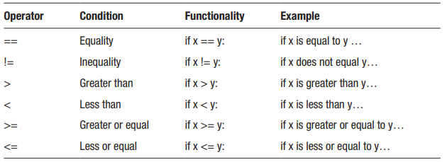

## 周二：If 语句
今天我们学习所有关于如何在代码里做决策，这会让我们学会决定哪些代码在程序中运行，根据用户输入的内容，计算等等。这是本周最重要的课程，一定要花足够的时间学习今天的课程。

跟着今天的课程，我们打开之前创建的notebook文件”Week_03”，在最下面的单个格中增加一个单元格并标注：”If statement。”

### 工作原理
你每天会做上百个决策，这些决策决定了你今天做什么。在程序中，他们被认为是分支语句或者if语句。
if语句跟做决策是一样的运行方式。检查条件，如果条件成立则执行任务，如果条件不成立，则不执行任务：
```markdown
“Am I hungry?”  
#我饿吗？

“Yes, so I should make some food.”  
#是的，所以我应该制作一些食物

*** proceeds to cook food ***      
#制作食物
```

同样的决策程序在程序中是使用一个if语句执行。
### 写下你的第一个If语句
所有分支语句都以关键词”if”开头，紧接其后的是条件。最后，一般会有一个冒号结束。if语句去检查给出的条件是真或者假（True或者False）。如果给出的条件为真则运行if模块代码；如果为假则程序跳过直接缩排在if语句下面的代码继续运行。

让我们试一试：
```python
# if语句只有条件满足时才会运行代码
x, y = 5, 10
if x < y:
    print("x is less than y")
```
在单元格中运行如上代码，这里的输出是”x is less than y”。这是因为我们最初申明了x=5和y=10，然后使用if语句去检查x是否小于10，实际x也小于10。如果x=15，那么缩排在if下面的print语句不会执行，因为条件为假。
### 比较运算符
在继续学习分支语句前，我们需要掌握比较运算符。到目前为止，我们使用算术运算符来进行值的加法和减法，使用赋值运算符来声明变量。随着if语句的引入，我们来学习比较运算符。你可以做几个比较。表3-2中列出了大部分你会用到的比较运算符。
**表3-2. **比较运算符



----

**注意** [w3 School](www.w3schools.com/python/python_operators.asp)上有大量关于不同类型运算符的其他参考资料

----

### 检查用户输入
大量应用我们刚学习的条件语句的情况是检查用户输入，让我们试一试：
```python
# 检查用户输入
ans = int( input("What is 5 + 5? ") )
if ans == 10:
    print("You got it right!")
```
1 www.w3schools.com/python/python_operators.asp

在单元格中运行如上代码，我们的条件语句去检查用户的输入是否等于整数10。如果等于，则执行if下面的打印语句。注意到在第二行我们请求用户输入并立即将他们的输入转换为整数。如果我们不使用try和except功能，在输入一个非数字时将出现错误。
### 逻辑运算符
逻辑运算符用于合并条件语句。你可以在1个if语句中写下多个条件主要你喜欢。If语句是否运行取决于逻辑运算符。让我们学习3个可以使用的逻辑运算符。
### 逻辑运算符”and”
当你检查2个条件时，”And”运算符用于确保两边的条件都是真。这意味着”And”左边或者右边任意一边的条件为假时，if下面的代码都不会被执行。让我们看一个例子：
```python
# 在if语句中使用关键词“and”
x, y, z = 5, 10, 5
if x < y and x == z:
    print("Both statements were true")
```
在单元格中运行如上代码，输出的结果应为”Both statements were true”，因为x小于y并且x等于z。

----

**注意** 你可以在一行中写下很多个条件

----

### 逻辑运算符”or”
逻辑运算符”or”用于检查1个条件为真或2个都为真。如果在”or”左边的条件为假，右边的条件为真，那么if下面的代码会被执行，因为至少有一个条件为真。在使用”or”运算符的时候只有一种情况下if模块不会运行，那就是两个条件都为假。我们来看一个案例：
```python
#在if语句中使用关键词”or”
x, y, z = 5, 10, 5
if x < y or x != z:
    print("One or both statements were true")
```
在单元格中运行如上代码，注意我们会得到结果-”One or both statements were true”。代码也执行了，尽管第二个条件为假，实际x等于z而我们去检查X是否不等于Z，。然而，因为”or左边的条件为真，代码被执行了。
### 逻辑运算符”not”
在某些情况下，你想检查值的相反值，”not”运算符刚好可以用上。他实际上返回的是当前值的相反值而不管当前值是什么。我们来试一下：
```python
# 在if语句中使用关键词“not”
flag = False
if not flag: # 等同于if not true
    print("Flag is False")
```
在单元格运行如上代码，你会注意到输出为” Flag is False”。由于”not”运算符的参与，它取了False的相反值让条件返回值为Ture。

----

**注意** 如果我们使用” if flag == Flase:” 也会得到相同的结果

----

### 成员运算符
成员运算符用于测试序列是否在目标中出现。这里有2个关键词我们可以用于去检查值是否存在于目标中。让我们拭目以待。
### 成员运算符”in”
当你想确认被提供的目标中是否存在一个值时，你可以使用”in”运算符。最经典的应用案例是在字符串中检查1个确定的值。我们来看一个例子：
```python
# 在if语句中使用关键词”in”
word = "Baseball"
if "b" in word:
    print("{ } contains the character b".format(word))
```
在单元格中运行如上代码，输出结果为”Baseball contains the character b”。这个是区分大小写的，但幸运的是单次Baseball中有一个小写的”b”和一个大写的”B”。
### 运算关系符”Not in”
同样的，如果你想检查目标中是否不包含一个特定的值，你又可以使用”not in”运算符。实际上是检查运算符”in”的相反面。如下：
```python
# 在if语句中使用关键词’not in’
word = "Baseball"
if "x" not in word:
    print("{ } does not contain the character x".format(word))
```
在单元格中运行如上代码，输出结果为”Baseball does not contain the character x”。代码简单检查了word变量对应的字符串中是否不存在x字符。

----

**周二练习**

----

1. **检查内含物 – 第一部分：** 请求用户输入并检查输入数据中是否包含”es”
2. **检查内含物 – 第二部分：** 请求用户输入并检查输入数据中是否以”ing”结尾。*提示*：使用Slicing。
3. **检查相等** ：请求用户输入两个词，写一个条件语句去检查两个词是否一致。让代码不区分大小写以防止大写字母影响判断。
4. **指数回报：** 请求用户输入一个数字，如果数字小于10则输出它的平方数。**提示：** 探索指数算术运算符的表达式。

今天是条件语句的重要一课。拥有让电脑基于条件做决策并执行一个动作的能力对任何程序都是重要且关键。
